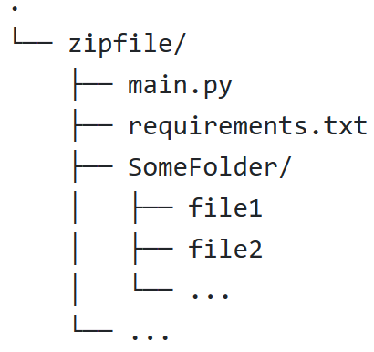

# MDEP

Malware Detector Evaluation Platform

MDEP is a platform for evaluating the effectiveness of malware detection tools. It allows users to upload their own detectors and runs them against a set of pre-defined datasets. The platform calculates various metrics to evaluate the performance of the detectors and provides users with detailed reports.

## Getting Started

To get started with MDEP, you will need to have Docker and Docker Compose installed on your machine. Once you have Docker and Docker Compose installed, you can follow these steps to run the platform:

1. Clone the MDEP repository to your local machine.
2. Navigate to the root directory of the repository.
3. Rename the `.env.example` file to `.env`.
4. Fill in the required values in the `.env` file.

```Dotenv
GITHUB_OAUTH_CLIENT_ID=XXXXXX
GITHUB_OAUTH_CLIENT_SECRECT=XXXXX
GITHUB_OAUTH_REDIRECT_URL=localhost:8000/auth/callback or CALLBACK_URI_YOU_WANT
MONGODB_URI=mongodb://mongo:27017 or YOUR_MONGODB_URI
MONGODB_USERNAME=YOUR_USERNAME
MONGODB_PASSWORD=YOUR_PASSWORD
MONGODB_VOLUME=/home/user/db or DB_PATH_YOU_WANT
DATASET_PATH=/home/user/dataset
```

5. Start the Docker containers by running the following command:`docker compose up -d --build`
6. Once the containers are running, you can access the platform by navigating to `http://localhost:8000/api` in your web browser.

That's it! You should now be able to use the MDEP platform to evaluate your malware detection tools. Please note that the platform is designed to be run on a server, so you may need to modify the Docker commands if you are running it in a different environment.

## Specification

To use MDEP, you will need to follow these specifications:

- The `main.py` file and `requirements.txt` file must be in the top level of the detector zip file.

- The dataset folder should be structured as follows:


    - Each subfolder in the dataset folder should be named as function.
    - Each subfolder should contain the corresponding binary files for the function.

- dataset.csv should be like

```CSV
filename,label
file1,label1
file2,label2
```
